<!-- hero: animated pixel-art avatar beside the 3D ASCII wordmark.
     avatar:   PIXEL_CROP=100,30,290 python scripts/make_pixel_avatar_svg.py
     wordmark: python scripts/make_wordmark_svg.py --mode rock
     based on github.com/AVIVASHISHTA29/AVIVASHISHTA29 -->

<h3><code>bdt@github ~ $ whoami</code></h3>

<table>
<tr>
<td valign="top"></td>
<td valign="top"></td>
</tr>
</table>

 
 

<!-- animated contribution graph: real data, refreshed daily by
     .github/workflows/update-profile-art.yml -->

<h3><code>bdt@github ~ $ ./contributions.sh</code></h3>

 
 

<h3><code>bdt@github ~ $ ./links.sh</code></h3>

<b>Bui Dinh Tuyen</b>

 

